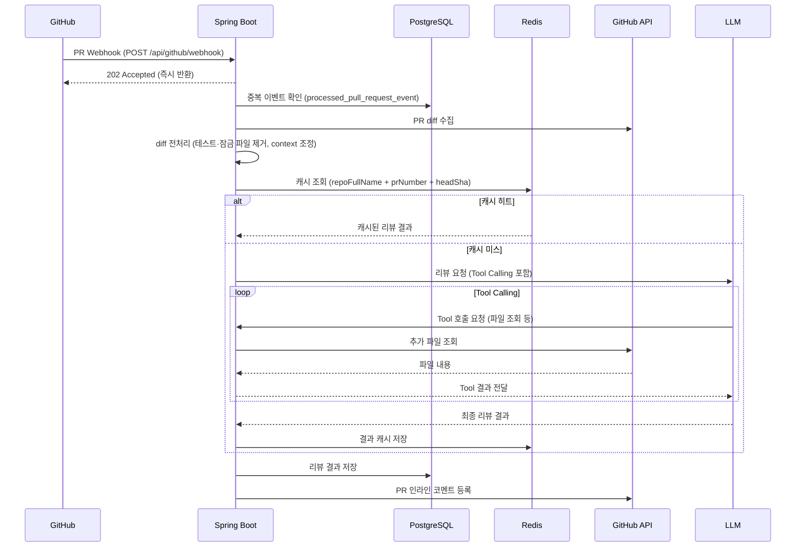
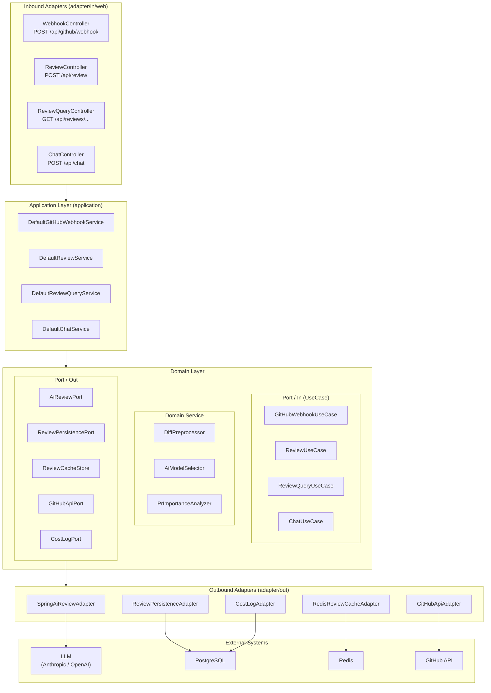
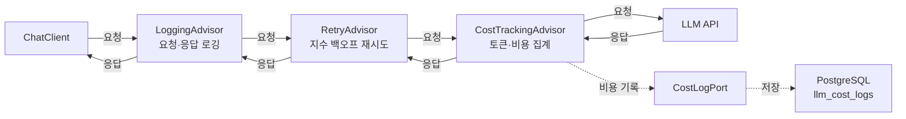
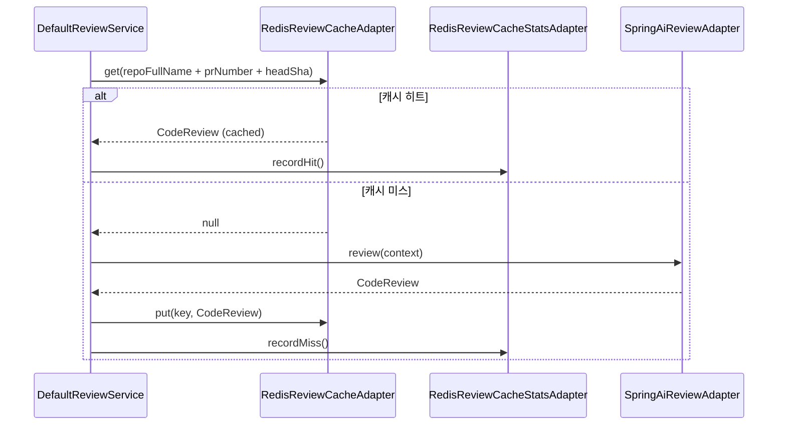
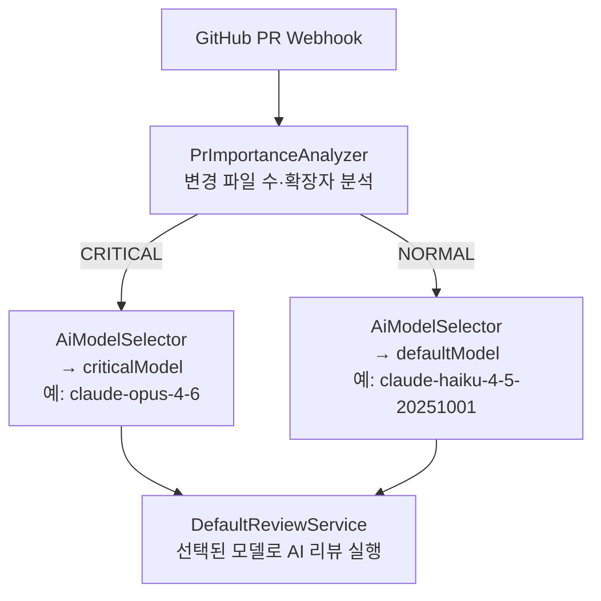

# 아키텍처

> GitHub PR Webhook 수신부터 AI 코드 리뷰 코멘트 등록까지의 전체 시스템 구조를 설명합니다.

---

## 1. 시스템 전체 흐름

GitHub PR 이벤트를 수신하고 AI 리뷰 결과를 PR에 등록하는 전체 시퀀스입니다.
Webhook은 202를 즉시 반환하여 GitHub 타임아웃을 방지하고, 실제 리뷰는 비동기로 처리됩니다.
Redis 캐시를 통해 동일 커밋의 반복 리뷰를 방지합니다.

---

## 2. 헥사고날 아키텍처

의존성 방향: **Inbound Adapters → Application → Domain ← Outbound Adapters**.
Domain은 외부를 직접 참조하지 않으며, Port 인터페이스를 통해 Outbound Adapter와 통신합니다.

### 계층 역할

| 계층 | 역할 | 주요 클래스 |
|------|------|------------|
| `domain/model` | 순수 도메인 모델 (외부 의존 없음) | `CodeReview`, `CodeIssue`, `DiffFilterOptions`, `PullRequestEvent` |
| `domain/port/in` | 인바운드 포트 — UseCase 인터페이스·결과 타입 | `ChatUseCase`, `ReviewUseCase`, `ReviewQueryUseCase`, `ReviewQueryResult`, `GitHubWebhookUseCase` |
| `domain/port/out` | 아웃바운드 포트 — 외부 시스템 추상화 | `AiChatPort`, `AiReviewPort`, `ReviewPersistencePort`, `ReviewCacheStore`, `GitHubApiPort`, `ProcessedEventPort` |
| `domain/service` | 순수 도메인 로직 | `DiffPreprocessor`, `FileExtensionClassifier`, `AiModelSelector`, `PrImportanceAnalyzer`, `DiffPositionResolver` |
| `application` | UseCase 구현체 — 포트 조합 | `DefaultChatService`, `DefaultReviewService`, `DefaultReviewQueryService`, `DefaultGitHubWebhookService` |
| `adapter/in/web` | HTTP 컨트롤러 | `ChatController`, `ReviewController`, `ReviewQueryController`, `WebhookController` |
| `adapter/out/ai` | AI API 클라이언트 | `SpringAiChatAdapter`, `SpringAiReviewAdapter` |
| `adapter/out/github` | GitHub API 클라이언트 | `GitHubApiAdapter`, `GitHubAppTokenProvider`, `JwtSigner`, `RsaKeyLoader` |
| `adapter/out/persistence` | DB 영속성 어댑터 | `ReviewPersistenceAdapter`, `ReviewQueryAdapter`, `CostLogAdapter`, `ProcessedEventAdapter` |
| `adapter/out/cache` | Redis 캐시 어댑터 | `RedisReviewCacheAdapter`, `RedisReviewCacheStatsAdapter` |
| `adapter/out/formatter` | 포맷팅 어댑터 | `MarkdownReviewCommentFormatter` |
| `common/advisor` | Spring AI Advisor (횡단 관심사) | `CostTrackingAdvisor`, `LoggingAdvisor`, `RetryAdvisor` |
| `common/port` | 공통 아웃바운드 포트 | `CostLogPort` |
| `common/metrics` | Micrometer 메트릭 | `LlmMetrics`, `ReviewMetrics` |
| `common/langfuse` | Langfuse 옵저버빌리티 | `LangfuseClient`, `LangfuseObservationHandler` |

---

## 3. Advisor 체인

Spring AI의 Advisor는 LLM 호출을 감싸는 데코레이터 패턴으로 동작합니다.
요청은 Advisor 순서대로 통과하고, 응답은 역순으로 반환됩니다.
`CostTrackingAdvisor`는 응답 수신 시 토큰·비용을 집계하여 DB에 기록하는 사이드 이펙트를 가집니다.

---

## 4. Redis 캐시 흐름

`DefaultReviewService`는 LLM 호출 전에 Redis 캐시를 먼저 조회합니다.
캐시 키는 `repoFullName + prNumber + headSha` 조합으로, 동일 커밋의 반복 리뷰를 방지합니다.
캐시 히트율은 `RedisReviewCacheStatsAdapter`가 집계하며 `/api/reviews/stats` 응답에 포함됩니다.

---

## 5. PR 중요도 라우팅

`PrImportanceAnalyzer`가 변경 파일 수·확장자를 분석하여 PR을 CRITICAL / NORMAL로 분류합니다.
`AiModelSelector`는 분류 결과에 따라 `AiReviewerProperties`에서 모델명을 선택합니다.
CRITICAL PR에는 더 강력한 모델(예: claude-opus-4-6)이, NORMAL PR에는 기본 모델(예: claude-haiku-4-5-20251001)이 사용됩니다.

